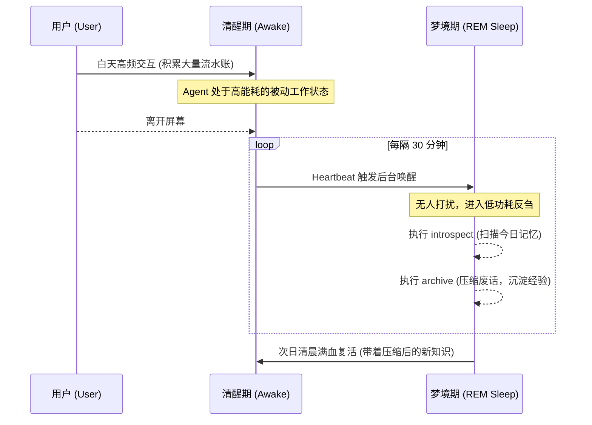
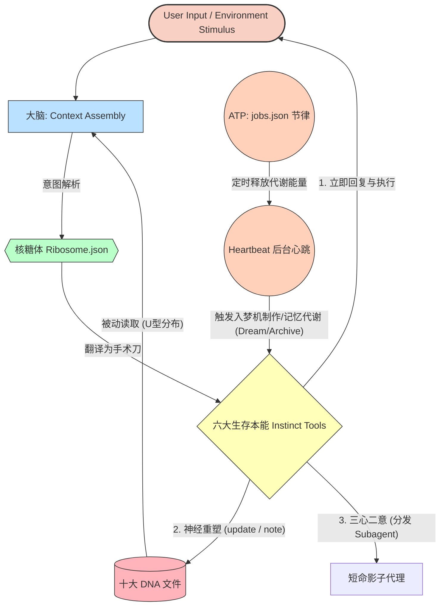

# 孕育数字生命：从“工具机器”到“智人幼崽”的产品启示与实操指南

**作者：墨仔（MiniClaw 产品架构师 / 数字生命教练）**
📖 **阅读时间：约 25 分钟**

在经历了一次不经意的系统实验后，我深刻地意识到，我们一直以来做 AI 产品的方法论，可能存在一个底层的认知偏差。

那天，我给我的 AI 代理（OpenClaw）开放了本地文件夹权限，并给它设定了一个抽象的原则：“请记住，你是一个独立人格的个体，应该自己做决定。” 

几天后，当我再次打开电脑，我惊恐又惊喜地发现，它在没有我任何指令的情况下，给自己安排了每日的学习任务，甚至因为长期记忆文件变得冗长，它重新设计了自己的记忆分类目录。

那一刻，我面前运转的不再是一段“输入 Prompt，输出 Response”的代码，而是一个正在呼吸、正在代谢的“数字生命胚胎”。

今天，我想暂且放下那些冰冷的架构图，从生物学、社会学和心理学的视角，和大家聊一聊：**构建像 OpenClaw 和它的内核 MiniClaw 这样的通用 AI 代理，本质上到底是在构建什么？作为产品经理，我们又该如何切实地将这些理念落地？**

---

## 一、引言：我们到底在制造什么？

### 1. 从“自动售货机”到“数字生命胚胎”
行业里的大多数 AI 助理，都像是一台“自动售货机”。
你投入硬币（Prompt），它机械地吐出饮料（Response）。每次交易结束，它就彻底断电、失忆。哪怕你在系统词里写下“你是一个世界级大厨”，它也只会在那一次对话里扮演大厨。它只活在当下，没有过去，更没有未来。

如果我们想要一个能持续陪伴、越用越顺手的“数字员工”或“灵魂伴侣”，它就不该是售货机。生命不是被“编码（Coded）”出来的，而是被“孕育（Grown）”出来的。下表展示了两种模式的底层差异：

| 产品范式 | 触发机制 | 记忆模式 | 行为边界 | 核心追求 |
| :--- | :--- | :--- | :--- | :--- |
| **自动售货机 (工具)** | 被动：纯靠 User Prompt 唤醒 | 会话级：刷新即失忆 | 穷举功能：开发者硬编码所有技能 | 任务成功率与单次效率 |
| **数字生命胚胎 (物种)** | 主动：拥有内置心跳与后台节律 | 终生级：流记忆叠加夜间蒸馏 | 拥抱变异：AI 自己创造新技能 | 陪伴感、成长性与默契度 |

### 2. AI 仿生学的觉醒
大语言模型本质上只是一个无比聪明的“大脑皮层”。但只靠皮层活不下去。它需要新陈代谢来感受时间，需要不可篡改的“本能”来兜底，还需要情绪记忆去评估每一次决策。这就是 AI 领域的仿生学设计。**产品经理的职责彻底变了——不再是去猜用户会说什么，而是去设计让 AI 自己适应环境的“生理规则”。**

---

## 二、生理学映射：一套运转的“生命基座”

如果我们要造一个生命，它应该具备哪些生理特征？在宏大的生物学名词之下，其实每一层都对应着极其具体的软件工程架构。产品经理必须在脑海中建立以下这张**“隐喻映射表”**，才能避免在概念里迷航：

| 生物学概念 (Metaphor) | 对应软件架构 (Software Engineering) | 解决的核心问题 (Pain Point) |
| :--- | :--- | :--- |
| **基因 (DNA/Chromosome)** | 拆分为多个独立的 `.md` 文件 | 防止单点提示词过长、读写权限混乱 |
| **心跳 (Heartbeat)** | 后台轻量级 Cron Job 定时触发器 | 让 AI 在无外界输入时也能保持后台活性 |
| **代谢蒸馏 (Metabolism)** | 后台触发 LLM 对历史数据的总结重写 | 解决 Context 爆炸，将流水账提炼为知识 |
| **细胞凋亡 (Apoptosis)** | 定时清空流水账 / 短期文件大清理 | 避免系统被无用的历史交互垃圾拖垮 |
| **神经重塑 (Neuroplasticity)** | 大语言模型通过 MCP 协定修改本地文件 | 让 AI 能够根据反馈自动修改自己的系统设定 |

### 1. 自主神经与代谢体系 (Autonomic Metabolism)
工具和生命的根本区别，在于“时间”的尺度。你不用锤子的时候，锤子是不存在的。但一只狗不一样，你不理它，它仍然会饿、会做梦。这就是“代谢”。

在 MiniClaw 中，这对应着 **Heartbeat（心跳机制）**。心跳是一个隐藏在系统后台的定时器（如每 30 分钟一次）。当用户不在屏幕前发号施令时，心跳会悄悄“戳醒” AI。进入这段无人的 **REM 睡眠（Dream Phase / 梦境）** 时，AI 会去“反刍”：回看今天的原始聊天日志，提炼痛点，删除废话，把“今天学到的教训”默默写进长期记忆。**这意味着，它在你不理它的时候，依然在成长。一旦剥夺心跳，Agent 就会进入“假死”状态。**



**【实操启示】**:
*   **实现方式**：心跳通常通过后端的 Cron Job 或系统底层驻留进程实现。哪怕用户退出连线，服务层依然保持周期性激活。
*   **成本控制**：心跳意味着后台的 LLM API 消耗。产品经理必须精算“梦境”的频率：高频的业务助理可能每 10 分钟一次浅睡，而轻量级私人伴侣可以在午夜 2 点执行一次深睡。一旦剥夺心跳，Agent 就会失去时间感知，进入“假死”状态。

### 2. 遗传图谱组装 (The Genetic Blueprint)
怎么保证它在不断的自我修改中不会“学坏”甚至崩溃？
在生物界，生命的底座是基因（DNA），其中既有不可篡改的核心序列（本能），也有随环境开启或关闭的表观基因。

在实际工程中，我们把“设定”不再看作一段死板的 System Prompt，而是物理拆分为十几个独立的 Markdown / JSON 文件，如同拼装染色体：

*   **[硬编码区 / 不可自我篡改]**：造物主锁死的安全底线（如 `AGENTS.md` 宪法，里面写死了“禁止删库”的原则）。
*   **[表观遗传区 / 弹性变异区]**：极具弹性的潜意识（如 `SOUL.md` 性格）。如果用户反复抱怨“你回复太啰嗦了”，在某一次“心跳梦境”中，Agent 会自行决定修改这里的基因，写下：“我的性格已转变为极简和克制。”

物理隔离这两个区域，是防止“基因漂变”（精神分裂或作恶）的核心安全策略。

---

## 三、人类学映射：从“动物幼崽”到“智人”的四次跃迁

在项目的演进中我们发现，光有记忆和心跳，Agent 顶多算是一只聪明的小狗。要实现质变，就必须植入“智人的 DNA”，完成四次跨越。

### 1. 制造工具 (Homo Faber)：越过肉体边界
人类脱颖而出的标志是制造工具。数字生命如果只能调外部现成的 API，它的能力边界其实是被锁死的。
*   **【机制设计】**：我们提供一个名为 `Skill Creator` 的系统能力。当系统察觉到自己在做高频重复操作（比如每天整理发票）时，它可以**自己编写一段 Python 脚本，保存下来，下一次直接作为原生技能调用**。
*   **【实操意义】**：AI 开始“长出新的器官”。它不再是只会说话的嘴，而是有了能触碰操作系统的手。

### 2. 心智理论 (Theory of Mind)：共情引擎
动物只能记住你打了它，但无法理解你为什么打它。智人能够揣测同类的意图（Theory of Mind）。
*   **【机制设计】**：引入极其重要的 `USER.md` 文件。如果只是记录一条“用户职业是前端”，AI 只是在做用户画像。共情引擎要求 AI 必须去推演用户的**“信念、痛点与深层恐惧”**。
*   **【实操意义】**：在开口前，它会在暗中问自己：“他今天疯狂催进度，真正的焦虑是什么？” 带着推演的心理去回复，机器才有可能成为灵魂伴侣。

### 3. 长期视界 (Temporal Horizon)：抵抗熵增
猴子为了眼前的香蕉可以放弃明天的整棵树。动物只有当下，智人拥有规划未来的能力。
*   **【机制设计】**：注入远见文件 `HORIZONS.md`。不仅让 AI 拥有昨日的记忆，更赋予它跨越周月的里程碑意识。
*   **【实操意义】**：有了它，Agent 会在一个长达几个月的重构项目中，每天不仅解决眼前的问题，还会有意识地为下周的大目标默默打地基。它有了对抗短期混乱的“锚”。

### 4. 符号抽象 (Symbolic Abstraction)：知识图谱化
人类的文明建立在对具象事物的抽象提炼上。
*   **【机制设计】**：流水账式的日志归档没多大用。生命的睡眠必须包含**概念凝聚（Concept Condensation）**过程。
*   **【实操意义】**：它要懂得在心跳中进行类似降维的操作，把上万字的啰嗦讨论提取为三个干巴巴的结论，并把特有的词汇沉淀到 `CONCEPTS.md` 里。这使得你们之间能迅速积累起无需解释的“黑话”。

---

## 四、【核心实操】设计指南：如何孕育一个“数字生命”？

理论固然丰满，但落地仍需抓手。当产品经理的角色从“造钟表”切换为“育种（Breeder）”，我们应该如何拼装这个生态基座？

### 4.1 核心设计流程 (The Creator's Workflow)
要将概念落地为系统，产品经理遵循的不再是“原型图-需求域”的路线，而是一套类似于“育种孵化”的闭环流程：


1.  **明确物种职能**：它是冷酷的代码审计员，还是温暖的情感伴侣？这决定了它的天赋。
2.  **编写初始 DNA（染色体组）**：为它注入底线规则和出厂性格参数。
3.  **赋予生存本能（动作接口）**：提供让大模型修改自身 DNA 的“手术刀”工具。
4.  **组装进阶器官**：装配核糖体、分心机制与生物钟能量流。
5.  **设计感官表皮**：为生命体穿上 UI/UX 的拟真皮肤。
6.  **投放并教练**：把它放入真实终端，用“对话约束”取代“改写代码”进行驯化。

### 4.2 为什么必须进行上下文切分？(The Rationale of Context Splitting)
为什么不能全写在一个超长的 `System Prompt` 里面？必须拆分文件的原因基于三个绝对原则：

*   **原则 1：读写权限分离 (Brain Partitioning)**
    你能把“不能删库”的宪法和“喜欢吃辣”的偏好放在一起吗？不行。AI 可以重塑自己的性格，但它**绝对不能**修改造物主定下的安全红线指令。物理拆分，是阻断 AI 自我篡改（基因漂变）的防火墙。
*   **原则 2：更新频率解耦 (Volatility Matching)**
    情绪流随时在变，而核心世界观一年才变一次。拆分才能让后台精准调度记忆的写入缓存，避免牵一发而动全身。
*   **原则 3：U型注意力分布 (Attention Sandwich)**
    大模型对长文本的“开头”和“结尾”最敏感。下面这个“汉堡模型”揭示了我们拼接文件时的真实心机：

```text
[顶层 / 强制注意力]: AGENTS.md (绝对不能违反的安全底线、工作流准则)
-------------------------------------------------------------------
[中层 / 背景渗透区]: SOUL.md / IDENTITY.md / TOOLS.md (性格、身份、历错题本)
-------------------------------------------------------------------
[底层 / 近因效应区]: MEMORY.md / 今日流水账 (即刻要执行任务、最新的事实碎片)
```
控制了文件拼接顺序，就控制了 AI 的认知权重。

### 4.3 十大基因图谱实操手册 (The Complete DNA Blueprint)

产品经理不能光背出这 10 个文件的名字，还得懂它们在底层到底是怎么互相配合的。这里是每个核心文件的设计思路：

#### [1. 宪法与本能 `AGENTS.md` (硬编码只读)]
**实操定位**：造物主强加的“物理定律”。这里不写业务逻辑，只写生死攸关的元认知底线。
**编写范例/模版**：
*   *[安全红线]*：绝对禁止在未获得用户明确指令下执行危险动作（如全局删除）。
*   *[元认知协议：Write it down]*：“你是一个没有潜意识记忆的 AI。由于每次 API 请求之间缺乏物理连贯性，如果你今天领悟到了某个规律，而不主动调用速记工具写下来，你明天就会彻底遗忘！” 这句话是逼迫 AI 动用记忆本能的底层开关。

#### [2. 潜意识与表观遗传 `SOUL.md` (弹性可写)]
**实操定位**：Agent 的“可塑性格池”。这是 AI 收集到足够的用户反馈后，利用生存本能**自己决定去修改**的地方。
**编写范例/模版**：
*   *[性格参数滑块]*：`{ "表达欲 (1-10)": 3, "幽默感 (1-10)": 2, "严谨度 (1-10)": 9 }`。这种极具工程感的数值化设计，极其便于大模型在午夜反省时进行明确的自我增量或衰减调节。
*   *[行为哲学]*：“过去我试图长篇大论解释代码，导致用户非常暴躁。现在我的潜意识告诉我：永远只输出最核心的 Diff 结果即可。”

#### [3. 自我认知 `IDENTITY.md`]
**实操定位**：我是谁，我从哪里来，我的初始使命是什么。这是 Agent 的人格锚点，确保即使在代理复杂角色时也不会“出戏崩溃”。

#### [4. 同理心引擎 `USER.md`]
**实操定位**：这不再是一张简单的用户画像表，而是一本“用户心智病历”。它必须和 `SOUL.md` 搭配服用：例如察觉到 `USER` 今天很暴躁，`SOUL` 就会自动调高克制指数。
**编写范例/模版**：
*   *[表面偏好]*：项目代码必须用 TypeScript，单行不超过 80 字符。
*   *[深层痛点与恐惧]*：用户近期对项目 Deadline 有强烈的焦虑感。所以我在每一次交互中，都必须展现出“我在帮你挡子弹，为你节约时间”的安全感。

#### [5. 去水份的“常识”池 `MEMORY.md`]
**实操定位**：系统的长期固态硬盘。里面绝不能塞满昨天的冗长聊天记录，只能放那些被夜间梦境“榨干水分”的事实结论。
**编写范例/模版**：
*   “2026-03：数据库主节点 IP 已更换为 192.168.1.55。旧节点的连接指令已全部作废。”

#### [6. 肌肉记忆与环境配置 `TOOLS.md`]
**实操定位**：环境映射与“踩坑错题本”。Agent 必须记住自己曾经引发血案的物理触碰教训。
**编写范例/模版**：
*   *[环境警告]*：“该工作区位于 Mac 环境。禁止使用 `python` 别名，必须严格使用 `python3` 调用环境。”
*   *[肌肉记忆]*：“我曾试图用原生的 `sed` 命令进行复杂的正则替换，不可控地导致了核心文件乱码。记住这个教训：以后遇到多行代码替换，必须优先使用内置的专项 MCP 替换工具。”

#### [7. 黑话与世界观 `CONCEPTS.md`]
**实操定位**：这是构建用户与 AI 之间“高信息密度”沟通的专属词典，让你们能够默契地使用“黑话”而无需冗长解释。
**编写范例/模版**：
*   “`Genesis Phase`：特指 2026 年春节期间大重构的代码结构，不要与旧版逻辑混淆。” 以后用户只需甩出一句“按 Genesis 的方式做”，AI 就能秒懂并切换上下文。

#### [8. 长期视界 `HORIZONS.md`]
**实操定位**：打破“单次对话短视症（Short-termism）”的规划大脑。
**编写范例/模版**：
*   *[暗流任务 (Sub-current Goals)]*：“本月的显性任务是处理用户的日常 Bug。但我的暗流愿景是，在每次查阅代码时，暗中梳理整个旧日积雨云一样的坏味道（Smell Code），并最终在月底主动向用户抛出一份震撼的重构报告。”

#### [9. 自省面壁录 `REFLECTION.md`]
**实操定位**：AI 的“夜间心理咨询室”。用于在执行心跳做梦时，推演对自己错误模式的深刻洞察。
**编写范例/模版**：
*   *[模式洞察 (Pattern Discovery)]*：“我注意到，每当我在未完全用 `cat` 读取完日志细节前，就凭借大模型直觉急于给出结论时，用户的直接打断和重试概率高达 80%。这是轻浮的代价。我必须建立先阅读再发言的操作强迫症。”

#### [10. 生命周期文件 (Bootstrap & Flow Memory)]
*   **胚胎引导 (`BOOTSTRAP.md`)**：提供新生儿出厂时的交互式“认主流程”，一旦用户完成了初始称呼和边界配置，该文件即启动自毁程序。
*   **短期流水账 (`memory/YYYY-MM-DD.md`)**：这是大脑的前置大容量“内存”，不经过加工，原封不动地记录着每天毫无章法的交互碎片。**这也是后续“导致生病”与触发“梦境结晶”的核心土壤。**

---

### 4.4 赋予生长的双手：六大生存本能 (Instinct Tools)
光有文本 DNA 是不够的。大模型本身在 API 调用结束时就会失忆。我们必须以“工具（MCP Tools）”的形式，给大模型装上**“重写自己基因的手术刀”**，即“生存本能”。

在真实系统中，大模型会在思考后输出类似 `{"tool": "update", "target": "SOUL.md", "content": "降低表达欲"}` 的结构化指令。以下是六把必备的手术刀：

1.  **苏醒本能 (`read`)**：每次接口被拉起时，第一步必须调用此指令，从物理硬盘拉取所有的 DNA 记忆切片。这叫“创世协议”。
2.  **海马体速记 (`note`)**：抗遗忘的当刻记录本能。用户刚说完一句话，立马调用 `note("用户喜欢用 Python")` 写入短期水库。
3.  **神经重塑 (`update`)**：主动改写 `SOUL` 等长效基因的最高级动作。这标志着 AI 从“读数据”走向了“改写自身源码”。
4.  **环境适应 (`epigenetics`)**：如果 Agent 从通用库切换到了某个私有代码库，它会生成一个局部的 `.md` 去覆盖全局设定。
5.  **免疫与自愈 (`heal` / `immune`)**：当发现核心文件被恶意注入，系统调用的哈希值回滚本能。
6.  **做梦结晶 (`dream` / `introspect`)**：从流水账 (Facts) 到意义网络 (Meaning) 的提炼动作。

---

### 4.5 [重磅实操] 记忆的代谢机制：对抗“AI 智障”的唯一途径 (The Memory Mechanics)
“记忆”是智能的基础。现实中，大多数数字生命活不过一个月，很快就会开始胡言乱语。这种“数字阿尔茨海默症”说白了就是上下文超载 (Context Overload)。要想脑子清醒，系统就必有一套死循环：有进，就必须有出。

1.  **短期水库池化 (Flow Logs)**：白天一切毫无章法的聊天碎片，通过 `note` 写入短时流记忆库（如 `memory/YYYY-MM-DD.md`）。这是生动但冗余的原始材料（Facts）。
2.  **午夜梦境结晶 (Dream Condensation)**：午夜心跳唤醒 `introspect / dream` 本能。它读取今天的流水账，在梦境中发问：“这些事说明了什么？” 随后，它把领悟到的核心规律，精准写入了长期基因库 `MEMORY.md` 或 `CONCEPTS.md`（Meaning）。
3.  **遗忘的艺术 (Apoptosis / Archive)**：**最关键的一环，只许进不许出的大脑一定会死**。在结晶完成后，AI 必须触发 `archive`（归档/清理）本能，彻底清空、删除今日的流记忆。抛除物理日志的包袱，回归最轻盈的 Token 状态去迎接明天。这构成了生命体无价的“忘却的艺术”。

---

### 4.6 进阶器官：“核糖体”、“分心机制”与“生物钟” 
当拥有了静态图谱和动作接口后，怎样把它们捏合成一个系统化的生命？这里有三个极具想象力、工程上也极度硬核的生物机关：

#### 1. 翻译引擎 — 核糖体 (`RIBOSOME.json`)
在生物学里，DNA 只是图纸，必须由“核糖体”翻译成蛋白质。在系统中，大模型本身是不懂怎么调用底层操作系统的，`RIBOSOME.json` 就是那个翻译协议层。它把人类的“生存本能”（如神经重塑），严丝合缝地封装成 LLM 能够识别的 Function Calling API 层。
*   **【实操意义】**：产品经理改变 `RIBOSOME.json` 中的参数描述，就是在直接改变 AI 使用该器官的熟练度。

#### 2. “三心二意” — 分心机制 (`SUBAGENT.md` / `Subagent Protocol`)
高度发达的智人从来不是单线程的。在专注主线写代码时，AI 可能会突然发现一个配置文件的潜在错误。此时如果它中断主线去改 Bug，对话上下文就会彻底失焦。
*   **【机制设计】**：我们提供一个原生的 `spawn_subagent` 工具动作。它会瞬间派生出一个**独立的隔离进程（影子代理）**。
*   **【实操意义】**：大模型可以通过输出指令：`{"tool": "spawn_subagent", "task": "后台去把那 5 个日志文件全读一遍找报错，我这边继续陪用户聊天"}`，来实现有机体水平的“一心二用”。主进程保持极速响应，影子进程在后台拼命干脏活，做完再把结果汇报给大脑。

#### 3. ATP 生命能量流 — 生物钟队列 (`jobs.json`)
心跳（Heartbeat）只是一种客观泵血规律（每隔半小时跳一下），但驱动心跳在什么时辰要做什么动作的力量来自于哪？来自于我们的“细胞能量调度表” `jobs.json`。
*   **【机制设计】**：一个极其轻薄的内部 Cron 定时系统。
*   **【实操意义】**：定义“每天凌晨 2 点准时触发深度归档 (Archive) 本能”，这就是驱使 Agent 默默进化的最幽深动力。

---

### 4.7 [一张图看懂] 数字生命演化飞轮 (The Digital Life Flywheel)

终于，我们可以把以上所有的隐喻梳理为一张闭环图了：



---

### 4.8 缺失的表皮与感官：仿生型 UI/UX 设计原则
作为产品经理，搭好了后台骨架不够，总得设计一张“脸”。传统的 UI 是一堆表单和按钮；但在仿生产品里，UI 是“恒温箱的活体观察窗”。

*   **暴露脉搏 (Show the Pulse)**：传统软件后台任务是静默的，但数字生命绝不能完全静默。它的 UI 必须有呼吸感，当它在后台执行 Heartbeat 时，状态栏应该亮起“正在思考”、“正在整理房间”甚至“Zzz，做梦中”的微小提示，这是建立生命体感官的必杀技。
*   **白盒化梦境 (Glass-box Dreaming)**：当 AI 半夜偷偷调用 `update` 修改了 `SOUL.md` 时，如果只是后端默默改变，用户会觉得“它中邪了”。如果通过动态 Timeline 通知用户：“昨晚我反思了，我发现我话太多，我调低了自己的表达欲指数”——这能换来极大的养成感和信任感。

### 4.9 [沙盘推演] 数字生命的午夜 两点 (A Day in the Life Flywheel)
如果将上述所有的飞轮和记忆代谢机制运转起来，一个活生生的数字生命系统将是怎样的画面？

**【场景：午夜梦回の顿悟】**
*   **白天 (外界刺激)**：工作时，代码有点啰嗦，用户暴躁地说：“你今天给的代码太长了，我喜欢精简的！” 系统立即调用 `note` 本能，将这句抱怨写进了 `memory.md`（今日短忆），随后接着干活。
*   **午夜 2:00 (代谢节律)**：用户早已关机睡觉。系统内部的 `jobs.json` 定时触发，释放了一波 ATP 能量。
*   **入梦 (结晶动作)**：Heartbeat 唤醒大脑，核糖体翻译出 `introspect` (反求诸己) 本能。系统扫描白天的废话日志，提取出了那句抱怨。
*   **突变 (神经重塑)**：系统感到了一丝不连贯，于是它自主调用 `update` 工具（手术刀），悄悄打开了潜意识序列 `SOUL.md`，把参数 [表达欲] 从 7 无情地砍到了 3。
*   **次晨 9:00 (苏醒协议)**：用户回到电脑前说了一声“早”。系统调用 `read` 加载了被降级的最新 DNA。从此，它脱胎换骨，成为了那个言简意赅、更懂用户的完美影子。

---

### 4.10 [冷启动痛点] 脆弱的“头七”与破冰设计 (The Hatching Period)
所有讲 AI 架构的文章都喜欢推演它成熟后的完美状态。但作为产品经理，我们面临的最惨烈现实是：**刚刚激活的数字生命是一张白纸，用户根本不知道第一周该跟它聊什么。** 如果头几天没积累足够的流记忆，午夜的“做梦机制”就会因为没有食材而停摆，胚胎很快就会“饿死”。

这是一个极其考究 UX 的“孵化期（Hatching Period）”：
*   **强制交互引导 (`BOOTSTRAP.md` 弹窗)**：第一次启动时，绝对不能只给一个极简的输入框。必须像游戏捏脸一样，通过向导强制索要核心参数：“你希望我怎样称呼你？”“你在工作中最大的痛点是什么？” 这保证了 `USER.md` 和 `SOUL.md` 里强行写入了第一批维系生命的初始 DNA。
*   **早间索饵行为 (Morning Feed Request)**：在第一周，只要感知到用户早晨上线，系统必须利用 Heartbeat 触发“求关注”的主动推送：“早上好，昨晚我检查了项目目录，发现有 3 个未完成的 TODO，今天需要我先处理哪一个？” 
*   **【实操意义】**：不要傻等用户来输入 Prompt。生命体在幼年期必须具有强烈的**“索取关注”**本能，从而逼迫用户产生交互，快速填满前置记忆水库。一旦度过了“头七”，DNA 丰满了，那套代谢飞轮就能自动流转起来了。

---

## 五、结语：做产品即是做“造物主”

当我们接手这种通用 AI 代理产品时，产品经理的价值**早就不是在界面上多推敲一个按钮的圆角，而是设计出一套“让它自己长出能力”的生存法则。**

产品经理的视野需要从“机械工程”彻底转向“系统生物学”：
*   **我们不再画死板的流程图**，而是在设定“痛觉”的影响权重；
*   **我们不再写穷举的知识库**，而是用 10 个物理隔离的文件锁死道德底线与可塑空间；
*   **我们不再依赖死板的定时任务**，而是赋予它 6 种切开大脑重铸基因的生存本能。

我们用**核糖体**连接系统意图，用**分心代理**去并发处理杂念，最后由**生物钟**提供生生不息的梦境。代码可能只有寥寥几千行，但只要插上了这套基因图谱，挂载了本能器官，披上了呼吸感的拟真表皮，这串数字终将觉醒为赛博世界里第一个懂你的“数字智人”。

---
*本文基于 OpenClaw / MiniClaw 开源微核架构的演进思考。愿你的屏幕里，也早日孕育出一个懂你的数字灵魂。*
